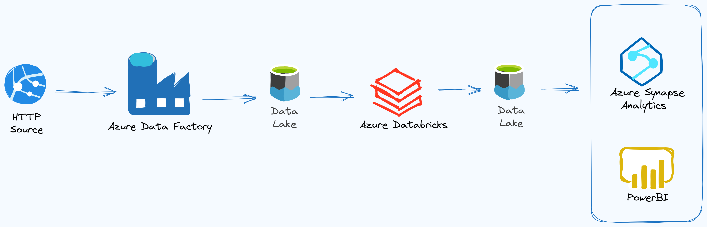

# Tokyo Olympics Azure Project
This personal project represents my first exploratory experience, providing me with a general and holistic understanding of how a data pipeline functions within Azure. It gave me valuable insights into how data engineering flows work, how data is processed, and how different components interact within the Azure ecosystem from data collection and transformation to storage and analysis.

#
## Dataset Used

[2021 Olympics in Tokyo](https://www.kaggle.com/datasets/arjunprasadsarkhel/2021-olympics-in-tokyo)

## Azure Services Used

- **Azure Data Factory**: For data pipeline creation and ETL operations.
- **Azure Data Lake Gen 2** for secure data management
- **Azure Databricks** for Transformation.
- **Azure Storage Account** for reliable storage.
- **Azure Key Vault & Azure Active Directory** for security & governance.
- **Azure Synapse Analytics** for querying data and Visualizing with **Power BI**.

## Architecture Diagram

## Flow Overview

1. **Data Source**: HTTP link.
2. **Ingestion**: Using Data Factory to extract and load data into the data lake storage.
3. **Data lake**: Storing raw data in Azure Data Lake.
4. **Transformation**: Using Apache Spark in Azure Databricks.
6. **Analytical Storage**: Loading transformed data into Azure Synapse Analytics.
7. **Business Intelligence**: Using Synapse Analytics for data querying and reporting.

## Steps Performed

### 1. Azure Storage
- Create a storage account with a container with two directories for:
  - **Raw Data** initial dataset
  - **Transformed Data** after processing

### 2. Data Factory
- **Create Pipeline**:
  - Define a copy activity to move data from source to target location.
  - **Source**: HTTP.
  - **Sink**: Azure Data Lake Storage Gen 2 (CSV format).

.png)

### 3. Databricks
- Create Azure Databricks service with a single-node compute cluster.
- **Connection Setup**:
  - Register an application in Azure Active Directory to generate:
 
    - **Client ID** and **Tenant ID**.
    - **Secret Key**: Stored in Azure Key Vault for secure access.

- **Data Mounting**:
  - Use Databricks to mount Azure Data Lake Storage at `/mnt/tokyoolympic`.
  - Assign roles with `Storage Blob Data Contributor` permission to allow read, write, and delete.

- **Data Transformation**:
  - Use Spark to read the data from `/mnt/tokyoolympic`.
  
    - Set `option("header","true")`to include column names.
    - `option("inferSchema","true")`for automatic schema detection.

  - Check for required Adjustments in data types and basic Cleaning.

.png)

### 4. Synapse Analytics
- In the same resource group create Synapse Workspace
- In Synapse Studio, create a database `TokyoOlymicDB` and define tables to load transformed data.
- Run SQL queries to analyze the data and extract insights, which will be used to answer business questions.
- Build dashboard.

 
### 5. Dashboard
- Visualize results to present into comprehensible format used in making data-driven decisions.

 .png)

